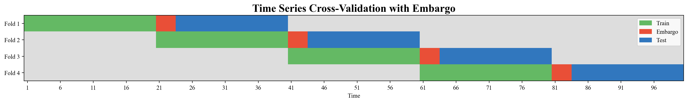

# TimeSeriesEmbargoCV

A custom cross-validation splitter for time series data with support for an *embargo* period between train and test sets.

## 📖 Overview

Traditional cross-validation strategies can lead to data leakage when used with time series data, especially in domains such as finance where temporal dependencies are crucial.  
**TimeSeriesEmbargoCV** implements a sequential, non-overlapping split with an embargo period that skips a configurable number of samples between training and test sets for each fold.  
This technique helps to prevent look-ahead bias and ensures that the model evaluation is robust and realistic.

## 🗝 Features

- **Embargo support:** Prevents information leakage by excluding a user-defined "embargo" window between train and test sets.
- **Scikit-learn compatibility:** Implements the standard `split` and `get_n_splits` API; works with sklearn pipelines and model selection tools.
- **Configurable:** Number of folds and embargo size can be easily adjusted.

## ⚙️ Use Case

This splitter is especially useful for:

- Financial machine learning and algorithmic trading backtesting.
- Any time-dependent modeling scenario where leakage between train and test sets must be strictly avoided.

## 🔓 Installation

No installation required. Just copy the TimeSeriesEmbargoCV class into your project.

# 📜 Lisence

MIT License

# ⚠️ Disclaimer

This project is provided for educational and research purposes only.  
It does **not** constitute financial advice or a recommendation to engage in any financial, trading, or investment activities.  
Any use of the code or techniques described herein is at the sole risk and responsibility of the user.  
The author(s) assume no liability for any direct or indirect losses or damages arising from the use or misuse of this code or related materials.
